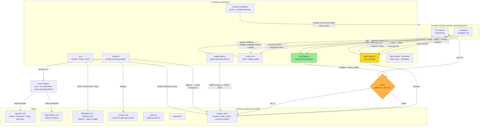
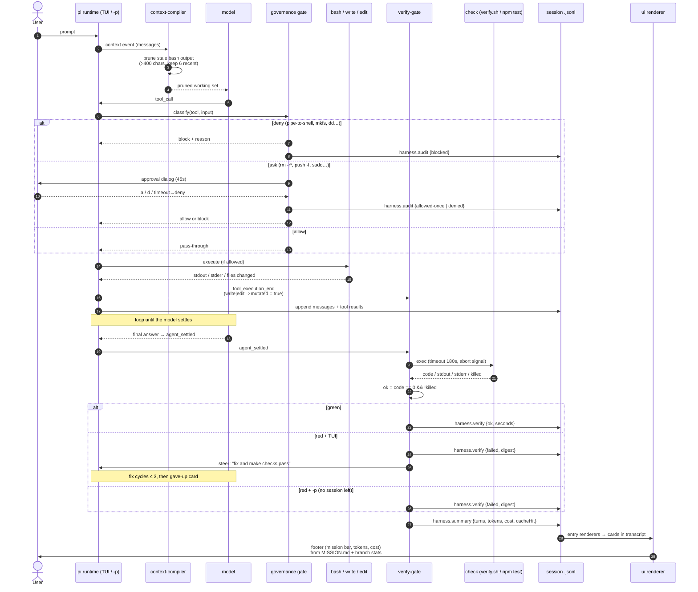
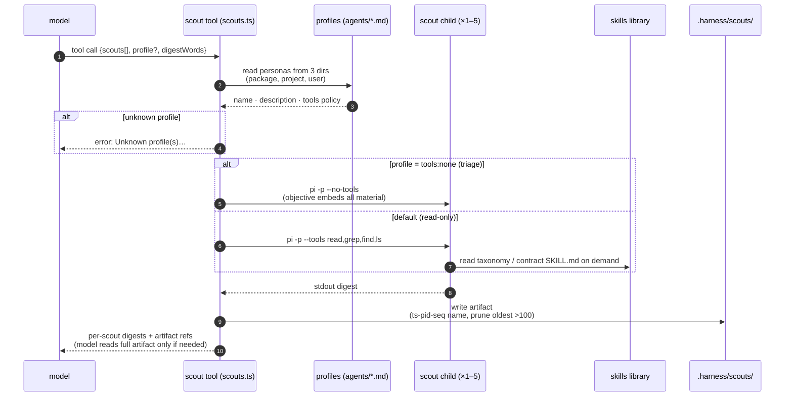

# pi-harness — architecture

> GitHub renders mermaid natively in Markdown. For the styled dark version, open `docs/architecture.html` locally (or the GitHub Pages URL once enabled).

## 1 · Component map

Every tool call — TUI or -p — passes governance first: deny
			blocks outright, ask renders the approval dialog in TUI (45 s timeout
			resolves to deny) or blocks with a reason in -p; every
			decision lands as a harness.audit entry. The UI layer is a
			pure consumer of MISSION.md and the session transcript.

## 2 · Data flow — one mutating turn

The verification path judges the child process's raw exit data —
			code == 0 && !killed — so a timed-out check can never read
			as green. In -p sessions the controller disposes the session
			at settle, so a red verdict is recorded in the transcript instead of
			steering; the interactive fix loop is TUI-only.

## 3 · Scouts — the parallel side channel

Scouts parallelize read-only work while decisions stay serialized with
			the main agent. Each child is an isolated pi -p session with
			no extensions and no skills preloaded — skills are a read-on-demand
			library, which is what keeps 5 concurrent specialists cheap.
